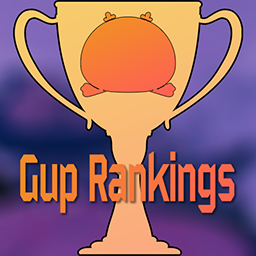
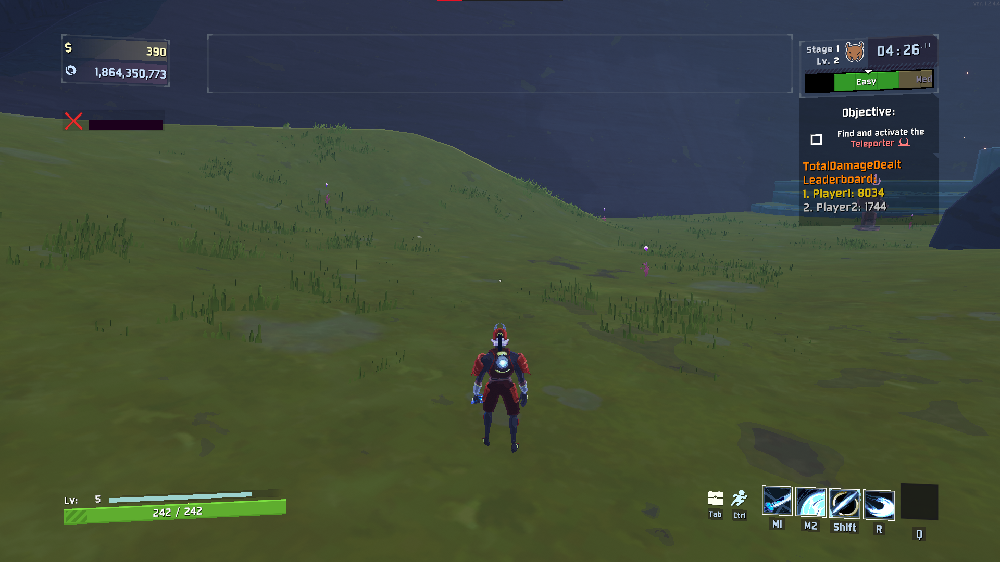

# GupRankings
A Risk of Rain 2 mod that adds a leaderboard component to the game to add a little bit of a competitive spirit to multiplayer runs so you can know who's carrying the run on their back!

    

## Features

### In-Game Leaderboard
Adds an in-game leaderboard to the objective panel based on different statistics. 

#### Leaderboard Statistics:
- Total Damage Dealt
- Total Minion Damage Dealt
- Highest Gold Collected
- Total Gold Spent
- Least Damage Taken
- Total Kills
- Total Elite Kills

To change the stat that is being used for the leaderboard, use the mod options. Whichever stat the host has set will be the stat used in the leaderboard. You also can change stats in the middle of a run. Other options for this feature include font size, player name display length, and the colors used for the leaderboard. 

## Planned Features

Some other features I would like to bring to the mod eventually:

- Age of Empires style post game summary.
- "Mario Party" style artifacts that give positive effects to the lower players on the leaderboard and negative effects to the higher ones.

## Bugs/Issues

This is my first Risk of Rain 2 mod so there may be some issues with it that I did not catch. If you encounter any bugs or issues please report them using one of the following.

- [Github Issues](https://github.com/cjcocokrisp/GupRankings/issues) (Preferred)
- Discord DM (karmareplicant)

## Credits

Developers:

- KarmaReplicant

Sources:
- https://github.com/Wet-Boys/LookingGlass (A great open source project that gave me some insight on how to draw to the objective panel)
- The RoR 2 Modding Wiki (A great resource that helped a lot during development)
- The RoR 2 Modding Discord (For answering my various questions when I was starting)

Other Thanks:
- My friends who helped test the mod.